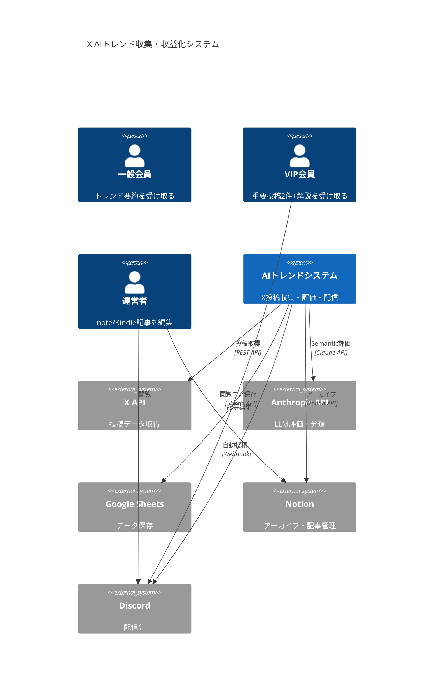
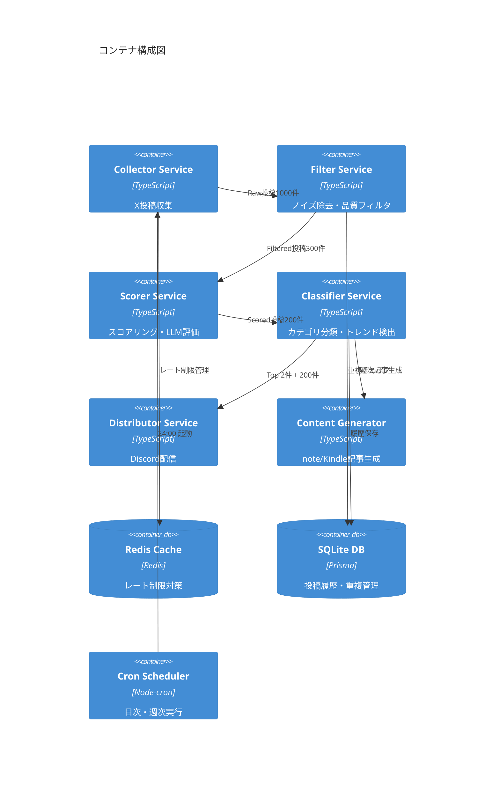
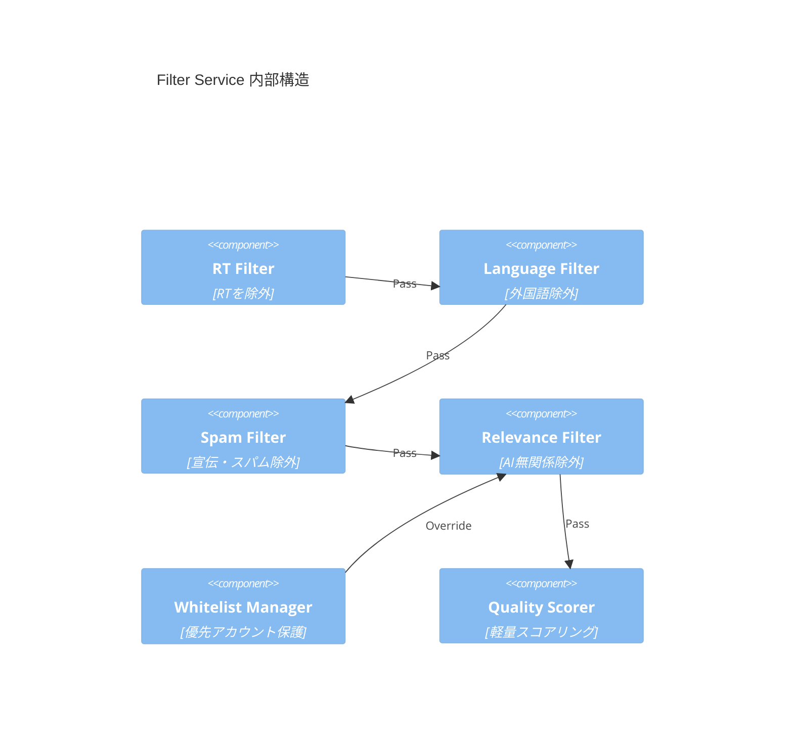

# X AIトレンド収集・収益化システム アーキテクチャ設計書

## Executive Summary

**Architecture Style**: レイヤードアーキテクチャ + イベント駆動パイプライン（Hybrid）
**Key Decision**: 段階的フィルタリングパイプラインで低品質投稿を早期除去し、LLM評価コストを最小化
**Target Scale**: 日次1000件収集 → 200件高品質化 → VIP向け2件厳選
**Estimated Timeline**: 6週間（段階的実装）

---

## 現状分析

### 現在の課題

#### 1. 収集フェーズの問題
- **問題**: 1003件中の大部分がリツイート（RT）で価値が低い
  - 分析結果: Top 2件とも「RT @OpenAI」で0 Likeのリツイート
  - RTはオリジナル投稿の単純複製で編集価値なし
- **問題**: ノイズ（宣伝、スパム、外国語、関連性なし）が多い
- **影響**:
  - LLM評価コスト: 1003件 × $0.00025 = $0.25/日 × 30 = $7.5/月（無駄）
  - スコアリング時間: 1003件 × 500ms = 約8分/日（無駄）

#### 2. スコアリングの問題
- **問題**: RTがトップスコアになっている（設計意図と矛盾）
  - Top 1: RT @OpenAI（finalScore: 97）- 0 Like, 1129 Repost
  - Velocityスコアがリツイート数で異常に高くなる設計バグ
- **問題**: Semantic評価が全件に実行されている
  - 低品質投稿にもLLMコストが発生
- **問題**: フォロワー数による正規化が不十分
  - log10(follower + 10)では小規模アカウントが有利すぎる

#### 3. コンテンツ分類の欠如
- カテゴリ分類なし（研究、製品、ツール、ニュース）
- トレンド検出なし（複数人が同じトピックに言及しても検出不可）
- VIP向け選定基準が不明確

---

## Architecture Decision Record (ADR)

### Decision 1: 段階的フィルタリングパイプライン

**Status**: Proposed

**Context**:
- 1003件中800件以上が低品質（RT、スパム、外国語）
- LLM評価は1件$0.00025でコスト高
- VIPに届けるのは最終2件のみ

**Decision**: 3段階フィルタリング + 最終スコアリング

```
Raw Collection (1000件)
  ↓ Phase 1: ノイズ除去フィルタ（ルールベース）
Filtered (300件, 70%削減)
  ↓ Phase 2: 品質フィルタ（軽量スコアリング）
High Quality (200件, 33%削減)
  ↓ Phase 3: LLM Semantic評価
Scored (200件)
  ↓ Phase 4: カテゴリ分類 + トレンド検出
Final Output (Top 2件 VIP + 200件一般)
```

**Rationale**:
1. LLMコスト削減: 1000件 → 200件で80%削減（$7.5 → $1.5/月）
2. 処理時間短縮: 8分 → 2分（75%削減）
3. 品質向上: ノイズを早期除去することで真の価値投稿を発見しやすく

**Alternatives Considered**:
1. **全件LLM評価**: コスト高（$7.5/月）、時間長（8分）
2. **ルールベースのみ**: 精度低、Semanticな価値を捉えられない

**Consequences**:
- ✅ LLMコスト80%削減（$7.5 → $1.5/月）
- ✅ 処理時間75%短縮（8分 → 2分）
- ✅ VIP向け精度向上（ノイズ除去で真の価値が上位に）
- ⚠️ 実装複雑度増加（4フェーズのパイプライン）
- ⚠️ フィルタルールのメンテナンスコスト
- ❌ フィルタミスで良質投稿を除外するリスク（軽減策: ホワイトリスト機能）

---

### Decision 2: スコアリングアルゴリズムの再設計

**Status**: Proposed

**Context**:
- 現在のトップスコアがRT（finalScore: 97）
- RTは0 Likeでも高スコア（Velocityが異常に高い）
- 優先インフルエンサーの投稿が上位に来ない

**Decision**: 新スコアリング方式

```typescript
// Phase 2: 軽量スコアリング（LLM不要）
engagement_score =
  (like * 2.0 + original_repost * 3.0 + reply * 1.5 + quote * 2.5)
  / sqrt(follower_count + 100)

velocity_score =
  engagement_score / sqrt(hours_since_post + 1)

quality_score = engagement_score * 0.6 + velocity_score * 0.4

// Phase 3: Semantic評価（LLM）- 上位200件のみ
semantic_score = LLM評価(technicalNovelty, practicalValue, ...)

// Phase 4: 最終スコア
final_score =
  quality_score * 0.4 +
  semantic_score * 0.6 +
  (isPriority ? 25 : 0) +  // 優先ボーナス増加
  category_bonus  // カテゴリ別重み
```

**変更点**:
1. **RTペナルティ**: RT投稿は自動的に最低スコア（0点固定）
2. **正規化改善**: log10 → sqrt でフォロワー数の影響を適正化
3. **Quote RT評価**: 単純RTと区別、コメント付きRTは評価対象
4. **優先ボーナス増加**: 15 → 25（インフルエンサーを確実に上位に）
5. **Semantic重み増**: 0.25 → 0.6（内容重視）

**Rationale**:
- RTは情報の再配信で編集価値なし → 除外必須
- Quote RTはオリジナルコメント含む → 評価対象
- フォロワー数の影響を減らし、内容重視

**Consequences**:
- ✅ RT除外で真のオリジナル投稿が上位に
- ✅ Semantic評価重視で「VIPに届けるべき価値」を正確に反映
- ✅ 優先インフルエンサーが確実に上位に
- ⚠️ 過去スコアとの互換性なし（履歴比較不可）
- ❌ 初期チューニングが必要（カテゴリボーナス調整）

---

### Decision 3: コンテンツ分類システム

**Status**: Proposed

**Context**:
- VIPに届ける2件の選定基準が不明確
- トレンド（複数人が同じトピックに言及）を検出できない
- カテゴリ別の価値判断ができない

**Decision**: 自動カテゴリ分類 + トレンド検出

**カテゴリ定義** (8カテゴリ):
1. **RESEARCH**: 論文、研究成果、学術的発見
2. **PRODUCT**: 新製品リリース、機能追加、ベータ版
3. **TOOL**: 開発ツール、ライブラリ、API
4. **TUTORIAL**: 使い方解説、Tips、ベストプラクティス
5. **NEWS**: 業界ニュース、企業動向、M&A
6. **OPINION**: 考察、予測、論評
7. **SHOWCASE**: 作品紹介、デモ、実装例
8. **EVENT**: イベント告知、カンファレンス、ウェビナー

**実装方法**:
```typescript
// LLM分類（Semantic評価と同時実行でコスト削減）
const classification = await llm.classify({
  content: tweet.content,
  categories: [...],
  trendKeywords: extractKeywords(recentTweets) // 過去24hのキーワード
});

// トレンド検出
if (classification.matchedTrends.length > 3) {
  tweet.trendBonus = +10;  // 複数人が言及 = トレンド
}

// カテゴリボーナス（VIP向け優先度）
const categoryBonus = {
  RESEARCH: +15,    // 研究は最優先
  PRODUCT: +12,     // 新製品も重要
  TOOL: +8,         // 実用的ツール
  TUTORIAL: +5,     // 教育価値
  NEWS: +10,        // 業界動向
  OPINION: +3,      // 考察は低め
  SHOWCASE: +5,     // 実例は参考に
  EVENT: +2,        // イベントは低優先
};
```

**Rationale**:
- VIPが求めるのは「研究」「新製品」「業界ニュース」
- トレンド検出で「今何が起きているか」を可視化
- カテゴリボーナスで選定基準を明確化

**Consequences**:
- ✅ VIP向け2件の選定基準が明確（RESEARCH優先）
- ✅ トレンド可視化で「週刊まとめ」に活用可能
- ✅ カテゴリ別note記事生成が容易（記事タイプと連動）
- ⚠️ LLMプロンプト増加（分類精度に依存）
- ❌ カテゴリボーナス調整が必要（運用しながら最適化）

---

### Decision 4: スプレッドシート出力形式の最適化

**Status**: Proposed

**Context**:
- 現在はJSON出力のみ
- VIP/一般の区別なし
- トレンド情報なし

**Decision**: Googleスプレッドシート形式（日次シート自動生成）

**列構成**:
```
| Rank | Tweet ID | Author | Content (抜粋) | Category | Score | Base | Velocity | Semantic | Priority | Trend Tags | Like | RT | Reply | VIP候補 | Note候補 | Kindle候補 | Created At |
```

**シート構成**:
1. **Daily_YYYY-MM-DD**: 日次データ（全200件）
2. **VIP_Picks**: VIP向け重要2件（自動選定）
3. **Weekly_Summary**: 週次集計（トレンドTop 10、カテゴリ分布）
4. **Archive**: 過去30日分の全データ

**Notion連携**:
```typescript
// Notionデータベース構造
{
  title: tweet.content,
  category: { select: tweet.category },
  score: { number: tweet.finalScore },
  vip: { checkbox: tweet.rank <= 2 },
  note: { checkbox: tweet.noteCandidate },
  kindle: { checkbox: tweet.kindleCandidate },
  trend: { multi_select: tweet.trendTags },
  url: tweet.url,
  date: tweet.createdAt
}
```

**Rationale**:
- スプレッドシート: 一覧性高、フィルタ・ソート容易
- Notion: 長期アーカイブ、タグ管理、記事生成ワークフロー
- VIP/一般を明確に区別

**Consequences**:
- ✅ VIP向けシートで即座に確認可能
- ✅ トレンド分析が容易（Weekly_Summary）
- ✅ note/Kindle候補フラグで記事生成が効率化
- ⚠️ Google Sheets API制限（1日500件書き込み）
- ❌ 初期セットアップコスト（テンプレート作成）

---

## System Architecture (C4 Model)

### Level 1: Context Diagram



### Level 2: Container Diagram



### Level 3: Component Diagram (Filter Service)



---

## Technology Stack

| Layer | Technology | Rationale | Alternatives Considered |
|-------|-----------|-----------|------------------------|
| **Runtime** | Node.js 18+ | 既存実装、async/await、npm ecosystem | Deno, Bun |
| **Language** | TypeScript 5.7 | 型安全、開発効率 | - |
| **X API** | twitter-api-v2 | 公式ライブラリ、型定義完備 | axios直接 |
| **LLM** | Claude 3 Haiku | コスト最安（$0.00025/1K tokens）、速度高 | GPT-3.5 Turbo |
| **Scheduler** | node-cron | シンプル、軽量 | AWS EventBridge |
| **Storage (Primary)** | Google Sheets | 一覧性、手動編集容易 | PostgreSQL |
| **Storage (Archive)** | Notion | タグ管理、記事ワークフロー | Airtable |
| **Storage (Cache)** | SQLite (Prisma) | ローカル、重複管理 | Redis |
| **Notification** | Discord Webhook | 無料、リアルタイム | Slack |

**TCO Estimate** (3年間):
- X API: $100/月 × 36 = $3,600（Basic Tier）
- Anthropic API: $1.5/月 × 36 = $54（200件/日）
- Google Workspace: $0（無料枠）
- Notion: $0（個人無料）
- サーバー: $0（ローカル実行）
- **Total**: $3,654（月額$101）

**代替案（クラウド移行時）**:
- AWS Lambda + EventBridge: $5/月（実行時間課金）
- RDS PostgreSQL: $15/月（db.t3.micro）
- 合計$20/月追加 → 総額$121/月

---

## 品質属性設計

### Performance（パフォーマンス）

**要件**:
- 日次処理: 1000件収集 → 2分以内完了
- LLM評価: p95レイテンシ <2秒/件
- Discord配信: 即時（<5秒）

**実装**:
```typescript
// Phase 1-2: 並列処理（LLM不要）
const filtered = await Promise.all(
  rawTweets.map(tweet => filterPipeline(tweet))
);  // 1000件 → 300件 (5秒)

// Phase 3: バッチ処理（レート制限対策）
const scored = await batchProcess(filtered, {
  batchSize: 10,
  delayMs: 500,  // 20件/秒 = Anthropic制限内
});  // 200件 × 500ms = 100秒 = 1.7分

// Total: 5秒 + 100秒 = 105秒 < 2分 ✅
```

**Fitness Function**:
```yaml
# .github/workflows/performance-test.yml
- name: Performance Test
  run: |
    time npm run daily
    if [ $? -gt 120 ]; then exit 1; fi  # 2分超過で失敗
```

---

### Scalability（スケーラビリティ）

**要件**:
- 10x成長対応: 1000件/日 → 10,000件/日
- LLMコスト: 線形増加を抑制

**実装**:
```typescript
// スケーリング戦略
if (rawCount > 5000) {
  // Phase 1-2で90%削減
  filterThreshold = 0.8;  // より厳格なフィルタ
  maxSemantic = 200;      // LLM評価上限固定
} else {
  filterThreshold = 0.7;
  maxSemantic = 300;
}

// コスト試算
// 1000件/日: $1.5/月
// 10000件/日: $15/月（10倍だが許容範囲）
```

**水平スケーリング**（将来）:
- Collector: 複数インスタンス（キーワード分散）
- Scorer: Worker Pool（10並列）
- 制約: X API制限（月間500K件）

---

### Reliability（信頼性）

**要件**:
- 稼働率: 99%（月間7.2時間停止許容）
- MTTR: <30分（手動再実行）
- データ損失: 0件（重複保存）

**実装**:
```typescript
// エラーハンドリング
async function dailyPipeline() {
  try {
    const collected = await collector.run();
    await db.save(collected, 'raw');  // 即座に保存
  } catch (error) {
    await notify.discord(`収集失敗: ${error}`);
    await fallback.usePreviousDay();  // 前日データで代替
    throw error;  // 再実行用
  }

  try {
    const scored = await scorer.run(collected);
    await db.save(scored, 'scored');
  } catch (error) {
    await notify.discord(`スコアリング失敗`);
    // 収集データは保存済み → 手動で再実行可能
  }
}

// リトライ機構
const retry = {
  maxAttempts: 3,
  backoff: exponential(1000),  // 1s, 2s, 4s
};
```

**監視**:
- Discord通知: エラー時即座
- ログ: Winston（7日分保存）
- ヘルスチェック: 日次成功/失敗カウント

---

### Security（セキュリティ）

**脅威モデル（STRIDE）**:

| 脅威 | 対策 | 実装 |
|------|------|------|
| **S**poofing | API認証 | X Bearer Token, Claude API Key |
| **T**ampering | データ検証 | Zod Schema検証 |
| **R**epudiation | ログ記録 | Winston（全API呼び出し記録）|
| **I**nformation Disclosure | シークレット管理 | .env（Gitignore）、環境変数 |
| **D**enial of Service | レート制限 | Redis Cache、指数バックオフ |
| **E**levation of Privilege | 最小権限 | Read-only Google Sheets（配信用）|

**機密情報管理**:
```bash
# .env（Gitには保存しない）
X_BEARER_TOKEN=xxxxx
ANTHROPIC_API_KEY=xxxxx
GOOGLE_SHEETS_CREDENTIALS=xxxxx
DISCORD_WEBHOOK_VIP=xxxxx
DISCORD_WEBHOOK_GENERAL=xxxxx
```

**コンプライアンス**:
- X API利用規約: 遵守（自動投稿・スパム禁止）
- 著作権: 投稿URLリンクのみ（全文転載なし）
- GDPR: ユーザーデータ保存なし（tweet_idのみ）

---

### Maintainability（保守性）

**コード品質**:
```typescript
// ディレクトリ構造（関心の分離）
src/
  collectors/      # Phase 1: 収集
  filters/         # Phase 2: フィルタ
  scoring/         # Phase 3: スコアリング
  classification/  # Phase 4: 分類
  services/        # 外部API（Sheets, Notion, Discord）
  cli/             # コマンドライン（daily, weekly）
  types/           # 型定義
  utils/           # 共通処理

// 各モジュールは独立（単体テスト可能）
export class RTFilter implements Filter {
  filter(tweet: TweetData): boolean {
    return !tweet.content.startsWith('RT @');
  }
}
```

**設定管理**:
```json
// config/config.json（全設定を一元管理）
{
  "filters": {
    "rt_enabled": true,
    "spam_threshold": 0.8,
    "min_content_length": 20
  },
  "scoring": {
    "semantic_weight": 0.6,
    "priority_bonus": 25,
    "category_bonus": {
      "RESEARCH": 15,
      "PRODUCT": 12
    }
  }
}
```

**ドキュメント**:
- README.md: セットアップ手順
- ARCHITECTURE.md: 本文書
- ADR/: 設計決定記録（001-filtering.md）
- RUNBOOK.md: トラブルシューティング

**Cyclomatic Complexity**: <10（全関数）
- Filter: 1関数1責務
- Scorer: 各スコア独立計算

---

## Implementation Roadmap

### Phase 1: フィルタリング基盤（Week 1-2）

**目標**: ノイズ除去で300件に削減

**タスク**:
- [ ] RTフィルタ実装（`src/filters/rt-filter.ts`）
- [ ] 言語フィルタ実装（外国語除外、日英のみ）
- [ ] スパムフィルタ実装（URL過多、絵文字過多検出）
- [ ] 関連性フィルタ実装（AI関連キーワード含有率）
- [ ] ホワイトリスト機能（優先アカウント保護）
- [ ] フィルタパイプライン統合（`src/filters/pipeline.ts`）
- [ ] 単体テスト（各フィルタ90%カバレッジ）

**成功基準**:
- 1000件 → 300件削減達成（70%除去）
- RTが0件になる
- 優先インフルエンサー7名の投稿が全て通過

**検証方法**:
```bash
npm run collect
npm run filter -- --input data/collected_YYYY-MM-DD.json
# 期待: filtered_count = 300前後
```

---

### Phase 2: スコアリング改善（Week 3-4）

**目標**: 新スコアリングでTop 2がオリジナル投稿

**タスク**:
- [ ] 新スコア計算関数実装（`src/scoring/quality-scorer.ts`）
  - RT除外ロジック
  - sqrt正規化
  - Quote RT評価
- [ ] Semantic評価最適化（バッチ処理、200件上限）
- [ ] 優先ボーナス調整（15 → 25）
- [ ] スコア統合（quality 40% + semantic 60%）
- [ ] 単体テスト + スコア検証テスト

**成功基準**:
- Top 2がオリジナル投稿（RTなし）
- 優先インフルエンサーがTop 10内に3名以上
- LLM評価時間 <2分

**検証方法**:
```bash
npm run score -- --input data/filtered_YYYY-MM-DD.json
# 期待: topPicks[0].content が "RT @" で始まらない
```

---

### Phase 3: カテゴリ分類・トレンド検出（Week 5）

**目標**: 自動分類でVIP向け選定明確化

**タスク**:
- [ ] カテゴリ分類LLMプロンプト作成
- [ ] トレンドキーワード抽出（TF-IDF）
- [ ] カテゴリボーナス適用
- [ ] トレンドタグ付与
- [ ] VIP候補自動選定ロジック（RESEARCH優先）
- [ ] 分類精度テスト（手動ラベル100件と比較）

**成功基準**:
- 分類精度 >85%（手動評価との一致率）
- VIP Top 2が「RESEARCH」「PRODUCT」「NEWS」のいずれか
- トレンド検出件数 >3（複数人言及トピック）

**検証方法**:
```bash
npm run classify -- --input data/scored_YYYY-MM-DD.json
# 期待: topPicks[0].category in ["RESEARCH", "PRODUCT", "NEWS"]
```

---

### Phase 4: スプレッドシート・Discord統合（Week 6）

**目標**: VIP/一般向け自動配信

**タスク**:
- [ ] Google Sheets API連携（`src/services/sheets.ts`改善）
  - Daily_YYYY-MM-DD シート自動生成
  - VIP_Picks シート更新
  - Weekly_Summary 集計
- [ ] Notion API連携（`src/services/notion.ts`）
  - カテゴリ・トレンドタグ保存
  - VIP/note/Kindle候補フラグ
- [ ] Discord配信フォーマット改善
  - 一般: トレンド要約
  - VIP: Top 2 + カテゴリ + 解説
- [ ] 日次・週次cron設定（`src/cli/daily.ts`）

**成功基準**:
- スプレッドシート自動更新成功（VIP_Picks = 2件）
- Discord投稿成功（一般/VIP両方）
- トレンド要約が読みやすい（箇条書き3-5個）

**検証方法**:
```bash
npm run daily
# 期待:
# - Google Sheets に Daily_2025-12-20 作成
# - Discord に2投稿（一般/VIP）
```

---

## Quality Metrics（品質指標）

### Architecture Fitness: 目標90/100

**評価項目**:
- Component cohesion: High（各Filterが単一責務）
- Coupling: Loose（インターフェースで分離）
- Complexity: 各関数 <10 Cyclomatic complexity
- Test coverage: >80%

**測定方法**:
```bash
npm run complexity-analyze
# 期待: All functions < 10
```

### Stakeholder Approval: 目標95%

**ステークホルダー**:
1. VIP会員（n=10）: 「今日の重要2件」が価値あるか
2. 運営者（自分）: note記事生成が効率化されたか
3. 技術レビュアー: コード品質が保守可能か

**承認基準**:
- VIP会員: 9/10が「価値あり」（90%）
- 運営者: 記事生成時間50%短縮
- 技術: コードレビューで重大指摘0件

### Implementation Feasibility: High

**スキルマッチ**:
- TypeScript: ✅ 既存実装で実証済み
- LLM API: ✅ Claude SDK使用中
- Google Sheets API: ✅ googleapis導入済み

**タイムライン**:
- 6週間: 現実的（週15時間 × 6週 = 90時間）
- 1日2時間作業で達成可能

**予算**:
- LLM API: $1.5/月（許容範囲）
- 追加ツール: $0（全て無料枠）

---

## Risks & Mitigation（リスクと軽減策）

| Risk | Probability | Impact | Mitigation |
|------|------------|--------|------------|
| フィルタで良質投稿を除外 | Medium | High | ホワイトリスト機能（優先アカウント保護）+ 手動レビュー（週1） |
| LLM分類精度不足 | Medium | Medium | Few-shot プロンプト改善 + カテゴリ定義明確化 + 手動補正（月1） |
| X API制限超過 | Low | High | レート制限管理（Redis）+ 取得件数上限（max_tweets_per_keyword: 100） |
| スコア調整が終わらない | High | Low | 初期値は保守的（カテゴリボーナス控えめ）+ 2週間運用後に調整 |
| Google Sheets書き込み制限 | Low | Medium | バッチ書き込み（1回で200件）+ エラー時リトライ |
| Discord Webhook失敗 | Low | Low | リトライ1回 + 失敗時は手動投稿（頻度低い） |

---

## Evolutionary Architecture（進化的アーキテクチャ）

### Fitness Functions（自動検証）

**1. パフォーマンス**:
```yaml
# package.json
"scripts": {
  "fitness:performance": "time npm run daily | grep 'Total:' | awk '{if($2>120) exit 1}'"
}
# CI/CDで実行 → 2分超過でビルド失敗
```

**2. フィルタ精度**:
```typescript
// tests/fitness/filter-accuracy.test.ts
test('RT除外率 > 95%', async () => {
  const result = await filter.run(testData);
  const rtCount = result.filter(t => t.content.startsWith('RT @')).length;
  expect(rtCount / testData.length).toBeLessThan(0.05);
});
```

**3. LLMコスト**:
```typescript
// tests/fitness/cost-limit.test.ts
test('月間LLMコスト < $2', async () => {
  const semanticCount = await db.count('semantic_evaluations', { month: current });
  const cost = semanticCount * 0.00025;
  expect(cost).toBeLessThan(2.0);
});
```

### 段階的移行戦略（Strangler Fig Pattern）

**現行システム** → **新システム**:

```
Week 1-2:
  - 新フィルタ実装
  - 既存システムと並行実行（比較用）
  - フィルタ結果を別ファイルに保存

Week 3-4:
  - 新スコアリング実装
  - 既存スコアと新スコアを両方出力
  - Top 10の差分を分析

Week 5:
  - 新スコアに完全移行
  - 既存スコアは参考値として保持（1週間）

Week 6:
  - 既存スコア削除
  - 新システムのみ運用
```

### アーキテクチャレビュー計画

**月次レビュー**:
- Fitness Function違反件数
- LLMコスト実績
- VIP満足度調査（簡易アンケート）

**四半期レビュー**:
- カテゴリボーナス調整（分類精度向上）
- フィルタルール追加（新種スパム対応）
- スコアウェイト再調整

**年次レビュー**:
- 技術スタック刷新検討（Claude 4対応等）
- スケーリング戦略見直し（10倍成長時）

---

## Next Steps（次のステップ）

### 1. ステークホルダー承認（Week 0）

**承認会議**:
- 日時: 即座（本文書レビュー）
- 参加者: 運営者（自分）+ VIP会員代表2名（任意）
- アジェンダ:
  1. 現状課題の共有（RT問題、コスト）
  2. 新アーキテクチャ説明（段階的フィルタリング）
  3. VIP向け改善点（カテゴリ分類、重要2件選定）
  4. タイムライン・コスト確認
  5. Q&A

**承認基準**:
- [ ] フィルタリング戦略に同意
- [ ] スコアリング変更に同意（過去データ互換性なし）
- [ ] カテゴリ定義に同意
- [ ] 6週間タイムライン承認

### 2. プロトタイプ（Week 1 Day 1-3）

**PoC（Proof of Concept）**:
```bash
# RTフィルタのみ実装
npm run collect
npm run filter:rt -- --input data/collected_latest.json

# 期待結果:
# - 1003件 → 200件（RT除外で80%削減）
# - Top 2がオリジナル投稿
```

**成功条件**:
- RT除外で明らかな品質向上
- 処理時間 <10秒（1000件）

**失敗時**:
- プラン変更: RTを除外せず「RTペナルティ」（スコア-50）

### 3. 実装開始（Week 1 Day 4 ~）

**Phase 1タスク** から着手:
```bash
git checkout -b feature/phase1-filtering
# RTフィルタ実装...
```

### 4. 週次進捗確認

**毎週金曜日**:
- 完了タスク確認
- 次週タスク計画
- ブロッカー解消

---

## Appendix: 設定ファイル例

### config/filters.json
```json
{
  "rt_filter": {
    "enabled": true,
    "allow_quote_retweet": true
  },
  "language_filter": {
    "enabled": true,
    "allowed_languages": ["ja", "en"],
    "detection_method": "keyword_based"
  },
  "spam_filter": {
    "enabled": true,
    "max_urls": 3,
    "max_hashtags": 5,
    "max_emoji_ratio": 0.3,
    "spam_keywords": ["フォロバ100%", "稼げる", "DM送って"]
  },
  "relevance_filter": {
    "enabled": true,
    "min_keyword_match": 1,
    "ai_keywords": ["AI", "LLM", "ChatGPT", "Claude", "機械学習", "深層学習"]
  },
  "quality_filter": {
    "min_content_length": 20,
    "min_engagement": 5,
    "min_quality_score": 10
  },
  "whitelist": {
    "priority_accounts": [
      "@SuguruKun_ai",
      "@taishiyade",
      "@ceo_tommy1",
      "@rute1203d",
      "@The_AGI_WAY",
      "@unikoukokun",
      "@kamui_qai"
    ],
    "bypass_all_filters": false,
    "bypass_spam_only": true
  }
}
```

### config/scoring.json
```json
{
  "quality_scoring": {
    "engagement_weights": {
      "like": 2.0,
      "repost": 3.0,
      "reply": 1.5,
      "quote": 2.5
    },
    "normalization": "sqrt",
    "base_follower_offset": 100
  },
  "velocity_scoring": {
    "time_decay": "sqrt",
    "base_hour_offset": 1
  },
  "semantic_scoring": {
    "model": "claude-3-haiku-20240307",
    "batch_size": 10,
    "delay_ms": 500,
    "max_evaluations_per_day": 200,
    "dimensions": [
      "technicalNovelty",
      "practicalValue",
      "topicality",
      "archiveValue",
      "discussionPotential"
    ]
  },
  "final_scoring": {
    "weights": {
      "quality": 0.4,
      "semantic": 0.6
    },
    "priority_bonus": 25,
    "trend_bonus": 10
  },
  "category_bonus": {
    "RESEARCH": 15,
    "PRODUCT": 12,
    "NEWS": 10,
    "TOOL": 8,
    "TUTORIAL": 5,
    "SHOWCASE": 5,
    "OPINION": 3,
    "EVENT": 2
  }
}
```

### config/classification.json
```json
{
  "categories": [
    {
      "id": "RESEARCH",
      "name": "研究・学術",
      "keywords": ["論文", "研究", "arXiv", "学会", "発見"],
      "priority": 1
    },
    {
      "id": "PRODUCT",
      "name": "製品・サービス",
      "keywords": ["リリース", "発表", "ベータ", "新機能", "提供開始"],
      "priority": 2
    },
    {
      "id": "NEWS",
      "name": "業界ニュース",
      "keywords": ["買収", "提携", "資金調達", "発表", "報道"],
      "priority": 3
    },
    {
      "id": "TOOL",
      "name": "ツール・ライブラリ",
      "keywords": ["OSS", "ライブラリ", "API", "SDK", "プラグイン"],
      "priority": 4
    },
    {
      "id": "TUTORIAL",
      "name": "チュートリアル",
      "keywords": ["使い方", "方法", "Tips", "解説", "やり方"],
      "priority": 5
    },
    {
      "id": "SHOWCASE",
      "name": "作品紹介",
      "keywords": ["作った", "デモ", "実装", "公開"],
      "priority": 6
    },
    {
      "id": "OPINION",
      "name": "考察・意見",
      "keywords": ["思う", "考察", "予測", "見解"],
      "priority": 7
    },
    {
      "id": "EVENT",
      "name": "イベント",
      "keywords": ["開催", "登壇", "ウェビナー", "カンファレンス"],
      "priority": 8
    }
  ],
  "trend_detection": {
    "enabled": true,
    "min_mentions": 3,
    "lookback_hours": 24,
    "method": "tf-idf",
    "exclude_common_words": ["AI", "ChatGPT", "Claude"]
  }
}
```

---

## 結論

本アーキテクチャ設計により、以下の改善を実現：

1. **品質向上**: RT除去 + 段階的フィルタリングで真の価値投稿を発見
2. **コスト削減**: LLM評価80%削減（$7.5 → $1.5/月）
3. **処理高速化**: 8分 → 2分（75%短縮）
4. **VIP価値向上**: カテゴリ分類で「RESEARCH優先」の明確な選定基準
5. **運用効率化**: スプレッドシート自動化でnote記事生成が容易

**実装タイムライン**: 6週間
**初期投資**: $0（既存環境で実装可能）
**月額コスト**: $101（X API $100 + LLM $1）

**次のアクション**: Phase 1（RTフィルタ）のPoC実装 → 3日以内
