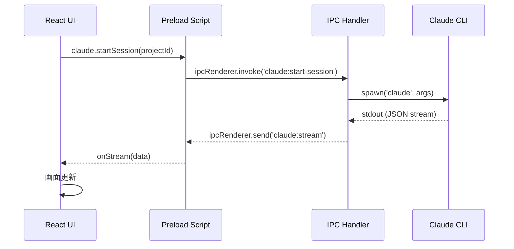

# Claude Code Desktop Integration 技術仕様書

**プロジェクト**: Claude Code Desktop App
**バージョン**: 1.0.0
**対象読者**: 開発者、AIアシスタント
**最終更新**: 2025-12-20

---

## 目次

1. [システム概要](#1-システム概要)
2. [前提条件・環境要件](#2-前提条件環境要件)
3. [アーキテクチャ設計](#3-アーキテクチャ設計)
4. [コア実装仕様](#4-コア実装仕様)
5. [データベース設計](#5-データベース設計)
6. [フロントエンド連携](#6-フロントエンド連携)
7. [セットアップ手順](#7-セットアップ手順)
8. [トラブルシューティング](#8-トラブルシューティング)

---

## 1. システム概要

### 1.1 アプリケーション構成

Electron + React + Claude CLIを統合したデスクトップアプリケーションです。

```
┌─────────────────────────────────────────────┐
│         Electron Desktop App                │
│                                             │
│  ┌──────────────┐       ┌──────────────┐   │
│  │  React UI    │◄─────►│ Main Process │   │
│  │  (Renderer)  │  IPC  │              │   │
│  └──────────────┘       └──────┬───────┘   │
│                                 │           │
└─────────────────────────────────┼───────────┘
                                  │
                                  ▼
                         ┌────────────────┐
                         │  Claude CLI    │
                         │  (child_process)│
                         └────────────────┘
```

### 1.2 主要機能

- **Claude CLI統合**: child_processでClaude CLIを起動、ストリーミング出力をリアルタイム取得
- **セッション管理**: SQLiteでチャット履歴・プロジェクト・生成物を永続化
- **セッションレジューム**: 過去のチャット履歴から続きを開始
- **セキュアなIPC通信**: contextBridgeによる安全なRenderer-Main間通信

### 1.3 技術スタック

| レイヤー | 技術 |
|---------|------|
| **UI Framework** | React 18.3.1, TypeScript 5.7.2 |
| **Desktop Framework** | Electron 33.2.0 |
| **ビルドツール** | Vite 6.0.3, vite-plugin-electron |
| **データベース** | better-sqlite3 11.6.0 |
| **スタイリング** | Tailwind CSS 3.4.16 |
| **プロセス管理** | Node.js child_process (spawn) |
| **Claude CLI** | claude (公式CLI) |

---

## 2. 前提条件・環境要件

### 2.1 必須環境

| 項目 | 要件 | 備考 |
|------|------|------|
| **Node.js** | 18.x以上 | ESモジュール対応 |
| **npm/pnpm** | 9.x以上 / 8.x以上 | 依存関係管理 |
| **Claude CLI** | 最新版 | `claude --version`で確認 |
| **OS** | macOS 12+, Windows 10+, Linux (Ubuntu 20.04+) | Electronサポート範囲 |

### 2.2 Claude CLI セットアップ

#### インストール

```bash
# macOS/Linux (Homebrew推奨)
brew install anthropics/tap/claude

# または、npm経由
npm install -g @anthropic-ai/claude-cli

# Windowsは公式インストーラーを使用
# https://docs.anthropic.com/claude/docs/claude-cli
```

#### 認証

```bash
# Claude CLIにログイン（ブラウザで認証）
claude auth login

# 認証確認
claude auth whoami
```

#### 動作確認

```bash
# テストプロンプト実行
claude -p "こんにちは、自己紹介してください。"

# ストリーミングJSON出力（アプリで使用するモード）
claude -p "Hello" --output-format stream-json
```

---

## 3. アーキテクチャ設計

### 3.1 プロセスアーキテクチャ

Electronは3つのプロセスで構成されます。

```
┌─────────────────────────────────────────────┐
│ Main Process (electron/main.ts)             │
│  - アプリライフサイクル管理                    │
│  - BrowserWindow作成                         │
│  - IPC通信ハンドラ登録                        │
│  - データベース初期化                         │
│  - Claude CLI起動（child_process.spawn）     │
└──────────────┬──────────────────────────────┘
               │ contextBridge
               │ (electron/preload.ts)
               ▼
┌─────────────────────────────────────────────┐
│ Renderer Process (React App)                │
│  - UI描画                                    │
│  - ユーザー操作受付                           │
│  - window.electronAPI経由でIPC送信            │
└─────────────────────────────────────────────┘
```

### 3.2 IPC通信フロー



### 3.3 セキュリティ設計

#### 原則

- **contextIsolation: true** - RendererとMainプロセスを完全分離
- **nodeIntegration: false** - RendererでNode.js APIを無効化
- **sandbox: false** (better-sqlite3のため必要)

#### コマンドインジェクション対策

```typescript
// electron/services/claude-cli.ts
private sanitizeInput(input: string): string {
  // 制御文字除去（改行・タブ以外）
  const sanitized = input.replace(/[\x00-\x08\x0B\x0C\x0E-\x1F\x7F]/g, '')

  // 最大サイズ検証
  if (sanitized.length > this.MAX_INPUT_SIZE) {
    throw new Error(`入力が長すぎます (最大${this.MAX_INPUT_SIZE / 1024}KB)`)
  }

  return sanitized
}
```

---

## 4. コア実装仕様

### 4.1 Electronメインプロセス

#### ファイル: `electron/main.ts`

**責務**:
- アプリケーションライフサイクル管理
- BrowserWindow作成とセキュリティ設定
- IPCハンドラ登録
- データベース初期化

**重要設定**:

```typescript
const mainWindow = new BrowserWindow({
  width: 1400,
  height: 900,
  minWidth: 1000,
  minHeight: 700,
  titleBarStyle: 'hiddenInset', // macOSネイティブウィンドウバー
  webPreferences: {
    preload: path.join(__dirname, 'preload.js'),
    nodeIntegration: false,  // セキュリティ: Renderer内でNode.js無効
    contextIsolation: true,  // セキュリティ: contextBridgeのみ許可
    sandbox: false,          // better-sqlite3のために必要
  },
  backgroundColor: '#0f172a',
  show: false, // ready-to-showまで非表示
})
```

**初期化シーケンス**:

```typescript
app.whenReady().then(async () => {
  // 1. データベース初期化
  await setupDatabase()

  // 2. IPCハンドラ登録
  setupClaudeIpcHandlers(ipcMain)
  setupProjectsIpcHandlers(ipcMain)
  setupSettingsIpcHandlers(ipcMain)
  setupAssetsIpcHandlers(ipcMain)

  // 3. メニュー作成
  createMenu()

  // 4. ウィンドウ作成
  createWindow()
})
```

---

### 4.2 Preload Script API仕様

#### ファイル: `electron/preload.ts`

**責務**:
- Renderer ProcessにセキュアなAPIを公開
- contextBridgeによる型安全なAPI露出

**公開API構造**:

```typescript
const electronAPI: ElectronAPI = {
  claude: { /* Claude CLI操作 */ },
  projects: { /* プロジェクトCRUD */ },
  assets: { /* 生成物管理 */ },
  settings: { /* 設定管理 */ },
  files: { /* ファイル操作 */ },
  app: { /* アプリイベント */ },
}

contextBridge.exposeInMainWorld('electronAPI', electronAPI)
```

**TypeScript型定義**:

```typescript
export interface ElectronAPI {
  claude: {
    startSession: (projectId: string) => Promise<{ sessionId: string; workspacePath: string }>
    sendMessage: (sessionId: string, message: string, systemPrompt?: string) => Promise<void>
    stopSession: (sessionId: string) => Promise<void>
    cancelExecution: (sessionId: string) => Promise<void>
    getHistory: (sessionId: string) => Promise<Array<{ role: string; content: string }>>
    listSessions: (projectId: string) => Promise<SessionInfo[]>
    getSessionWithMessages: (sessionId: string) => Promise<SessionWithMessages | null>
    deleteSession: (sessionId: string) => Promise<void>
    resumeSession: (sessionId: string) => Promise<ResumeSessionResult>
    onStream: (callback: (data: StreamData) => void) => void
    onComplete: (callback: () => void) => void
    onError: (callback: (error: string) => void) => void
    removeAllListeners: () => void
  }
  // ... (projects, assets, settings, files, app)
}
```

---

### 4.3 IPC通信仕様

#### 4.3.1 Claude IPC (electron/ipc/claude.ts)

**チャネル一覧**:

| チャネル名 | 方向 | 引数 | 戻り値 | 説明 |
|-----------|------|------|--------|------|
| `claude:start-session` | invoke | `projectId: string` | `{ sessionId, workspacePath }` | セッション開始 |
| `claude:send-message` | invoke | `sessionId, message, systemPrompt?` | `void` | メッセージ送信 |
| `claude:stop-session` | invoke | `sessionId` | `void` | セッション停止 |
| `claude:cancel` | invoke | `sessionId` | `void` | 実行キャンセル |
| `claude:get-history` | invoke | `sessionId` | `Message[]` | 履歴取得 |
| `claude:list-sessions` | invoke | `projectId` | `SessionInfo[]` | セッション一覧 |
| `claude:get-session-with-messages` | invoke | `sessionId` | `SessionWithMessages` | セッション+メッセージ |
| `claude:delete-session` | invoke | `sessionId` | `void` | セッション削除 |
| `claude:resume-session` | invoke | `sessionId` | `ResumeSessionResult` | セッション再開 |
| `claude:stream` | send (Main→Renderer) | `StreamData` | - | ストリーム出力 |
| `claude:complete` | send (Main→Renderer) | `{ code: number }` | - | 実行完了 |
| `claude:error` | send (Main→Renderer) | `error: string` | - | エラー通知 |

**セッション開始フロー**:

```typescript
ipcMain.handle('claude:start-session', async (event, projectId: string) => {
  // 1. プロジェクト取得
  const project = dbHelpers.getProject(projectId)

  // 2. セッションID生成
  const sessionId = crypto.randomUUID().replace(/-/g, '')

  // 3. Claude CLIセッション作成
  const { session, workspacePath } = await manager.createSession(sessionId, project)

  // 4. DB記録
  dbHelpers.createSession(projectId, workspacePath, sessionId)

  // 5. イベントリスナー設定
  session.on('stream', (data) => win?.webContents.send('claude:stream', data))
  session.on('complete', (code) => win?.webContents.send('claude:complete', { code }))
  session.on('error', (error) => win?.webContents.send('claude:error', error))

  return { sessionId, workspacePath }
})
```

#### 4.3.2 Projects IPC

| チャネル名 | 引数 | 戻り値 | 説明 |
|-----------|------|--------|------|
| `projects:list` | - | `Project[]` | 全プロジェクト取得 |
| `projects:get` | `id: string` | `Project` | プロジェクト詳細 |
| `projects:create` | `CreateProjectData` | `Project` | プロジェクト作成 |
| `projects:update` | `id, Partial<CreateProjectData>` | `Project` | プロジェクト更新 |
| `projects:delete` | `id: string` | `void` | プロジェクト削除 |

#### 4.3.3 Settings IPC

| チャネル名 | 引数 | 戻り値 | 説明 |
|-----------|------|--------|------|
| `settings:get` | `key: string` | `T \| null` | 設定取得 |
| `settings:set` | `key: string, value: T` | `void` | 設定保存 |
| `settings:get-claude-path` | - | `string` | Claude CLIパス |
| `settings:set-claude-path` | `path: string` | `void` | Claude CLIパス設定 |
| `settings:get-workspace-base` | - | `string` | ワークスペース基底パス |
| `settings:check-claude-cli` | - | `ClaudeCliStatus` | Claude CLI動作確認 |

---

### 4.4 Claude CLI統合仕様（最重要）

#### 4.4.1 ClaudeSessionManagerクラス

**ファイル**: `electron/services/claude-cli.ts`
**責務**: Claude CLIセッションのライフサイクル管理

```typescript
export class ClaudeSessionManager {
  private sessions: Map<string, ClaudeCLISession> = new Map()
  private claudePath: string = 'claude'
  private workspaceBase: string

  constructor(workspaceBase: string) {
    this.workspaceBase = workspaceBase
  }

  async createSession(
    sessionId: string,
    projectContext?: Record<string, unknown>,
    workspacePath?: string
  ): Promise<{ session: ClaudeCLISession; workspacePath: string }>

  getSession(sessionId: string): ClaudeCLISession | undefined

  async stopSession(sessionId: string): Promise<void>
}
```

**セッション作成時の処理**:

1. **セキュリティ検証**:
   ```typescript
   // パストラバーサル対策
   if (sessionId.includes('..') || sessionId.includes('/') || sessionId.includes('\\')) {
     throw new Error('無効なセッションID')
   }

   // 英数字のみ許可
   if (!/^[a-zA-Z0-9]+$/.test(sessionId)) {
     throw new Error('セッションIDは英数字のみ使用可能です')
   }
   ```

2. **ワークスペース作成**:
   ```typescript
   const resolvedWorkspacePath = path.resolve(
     workspacePath ?? path.join(this.workspaceBase, sessionId)
   )

   await fs.promises.mkdir(resolvedWorkspacePath, { recursive: true })
   ```

#### 4.4.2 ClaudeCLISessionクラス

**責務**: 単一Claude CLIプロセスの管理

**主要プロパティ**:

```typescript
export class ClaudeCLISession extends EventEmitter {
  private process: ChildProcess | null = null
  private workspacePath: string
  private claudePath: string
  private allowedTools: string[] // ['Read', 'Write', 'Edit', 'Bash', ...]
  private timeout: number // 600000ms (10分)
  private buffer: string = '' // ストリーム出力バッファ
  private claudeSessionId: string | null = null // Claude CLI内部セッションID

  // セキュリティ・安定性フィールド
  private readonly MAX_BUFFER_SIZE = 10 * 1024 * 1024 // 10MB
  private readonly MAX_INPUT_SIZE = 100 * 1024 // 100KB
  private readonly MAX_CHUNK_SIZE = 1024 * 1024 // 1MB
  private decoder: StringDecoder = new StringDecoder('utf8')
  private isCancelled = false
  private timeoutId: NodeJS.Timeout | null = null
  private lastOutputTime: number = Date.now()
  private heartbeatInterval: NodeJS.Timeout | null = null

  // レースコンディション対策
  private bufferQueue: string[] = []
  private isProcessingQueue = false
}
```

**メッセージ送信フロー**:

```typescript
async sendMessage(message: string, options: SendMessageOptions = {}): Promise<void> {
  // 1. 既存プロセス停止（重複起動防止）
  if (this.isRunning) {
    await this.cancelAsync()
  }

  // 2. 状態リセット
  this.isCancelled = false
  this.buffer = ''
  this.bufferQueue = []

  // 3. Claude CLI実行
  await this.executeClaudeCLI(message, options.systemPrompt || '')
}
```

**Claude CLI起動 (executeClaudeCLI)**:

```typescript
private async executeClaudeCLI(message: string, systemPrompt: string): Promise<void> {
  // 1. 入力サニタイズ
  const sanitizedMessage = this.sanitizeInput(message)
  const sanitizedSystemPrompt = this.sanitizeInput(systemPrompt)

  // 2. プロンプト結合
  let fullPrompt = sanitizedMessage
  if (sanitizedSystemPrompt) {
    fullPrompt = `${sanitizedSystemPrompt}\n\n---\n\nユーザーからのリクエスト:\n${sanitizedMessage}`
  }

  // 3. CLIコマンド引数構築
  const args: string[] = [
    '-p', fullPrompt,
    '--output-format', 'stream-json', // ストリーミングJSON出力
    '--verbose',
    '--dangerously-skip-permissions', // ファイル操作権限
  ]

  // レジューム（既存セッション続行）
  if (this.claudeSessionId) {
    args.push('--resume', this.claudeSessionId)
  }

  // 4. プロセス起動
  this.process = spawn(this.claudePath, args, {
    cwd: this.workspacePath,
    stdio: ['ignore', 'pipe', 'pipe'], // stdin無視, stdout/stderr取得
    env: {
      ...process.env,
      TERM: 'xterm-256color',
      FORCE_COLOR: '0', // ANSI色無効
      NODE_NO_WARNINGS: '1',
    },
    shell: false, // シェルインジェクション対策
    windowsHide: true, // Windowsでコンソール非表示
  })

  // 5. タイムアウト設定（10分）
  this.timeoutId = setTimeout(() => {
    this.emit('error', `タイムアウト: ${this.timeout / 1000}秒経過しました`)
    this.cancelAsync()
  }, this.timeout)

  // 6. ハートビート監視（5分無応答で中止）
  this.heartbeatInterval = setInterval(() => {
    const silence = Date.now() - this.lastOutputTime
    if (silence > 300000) {
      this.emit('error', 'プロセスが5分間応答なし')
      this.cancelAsync()
    }
  }, 30000)

  // 7. stdoutハンドラ（ストリーミング出力）
  this.process.stdout?.on('data', (chunk: Buffer) => {
    this.lastOutputTime = Date.now()
    const text = this.decoder.write(chunk)
    if (text.length > 0) {
      this.bufferQueue.push(text) // キューに追加
      this.processBufferQueue()    // 非同期処理
    }
  })

  // 8. stderrハンドラ（エラー分類）
  this.process.stderr?.on('data', (chunk: Buffer) => {
    const text = chunk.toString()
    if (text.includes('FATAL') || text.includes('CRITICAL')) {
      this.emit('error', text)
      this.cancelAsync()
    }
  })

  // 9. closeハンドラ（プロセス終了）
  this.process.on('close', (code, signal) => {
    this.processBufferQueue(true) // 残りバッファ処理
    this.emit('complete', code ?? -1)
    this.cleanup()
    this.process = null
  })
}
```

**ストリーミング出力パース**:

```typescript
private processBufferQueue(flush: boolean = false): void {
  if (this.isProcessingQueue && !flush) return

  this.isProcessingQueue = true

  // キューのチャンクを結合
  while (this.bufferQueue.length > 0) {
    const chunk = this.bufferQueue.shift()!
    this.buffer += chunk

    // バッファオーバーフロー検出
    if (this.buffer.length > this.MAX_BUFFER_SIZE) {
      this.emit('error', 'バッファオーバーフロー')
      this.cancelAsync()
      return
    }
  }

  // 改行で分割
  const lines = this.buffer.split('\n')
  if (!flush) {
    this.buffer = lines.pop() || '' // 最後の不完全行は保持
  }

  // 各行をJSON解析
  for (const line of lines) {
    const trimmed = line.trim()
    if (!trimmed || !trimmed.startsWith('{')) continue

    try {
      const data = JSON.parse(trimmed)
      const streamData = this.parseClaudeOutput(data)
      if (streamData) {
        this.emit('stream', streamData)
      }
    } catch (err) {
      this.emit('stream', { type: 'text', content: trimmed })
    }
  }

  this.isProcessingQueue = false
}
```

**Claude出力イベント解析**:

```typescript
private parseClaudeOutput(data: Record<string, unknown>): StreamData | null {
  const type = data.type as string

  // セッションID保存（レジューム用）
  if (data.session_id && !this.claudeSessionId) {
    this.claudeSessionId = data.session_id as string
  }

  switch (type) {
    case 'assistant':
      return { type: 'assistant', content: this.extractContent(data) }

    case 'content_block_delta':
      const delta = data.delta as Record<string, unknown>
      if (delta?.type === 'text_delta') {
        return { type: 'text', content: delta.text as string }
      }
      return null

    case 'tool_use':
      return {
        type: 'tool_use',
        toolName: data.name as string,
        toolInput: data.input,
      }

    case 'tool_result':
      return {
        type: 'tool_result',
        toolName: data.tool_name as string,
        result: data.content || data.output,
      }

    case 'error':
      return { type: 'error', content: data.error as string }

    default:
      return null
  }
}
```

---

## 5. データベース設計

### 5.1 SQLiteスキーマ

**ファイル**: `electron/database/schema.sql`

**ER図**:

```
┌──────────────┐
│  projects    │
│  (id: PK)    │
└──┬───────────┘
   │ 1
   │
   │ N
┌──┴───────────────┐        ┌─────────────────┐
│ claude_sessions  │        │ generated_assets│
│ (id: PK)         │◄──────►│ (id: PK)        │
│ project_id: FK   │   N    │ project_id: FK  │
└──┬───────────────┘        │ session_id: FK  │
   │ 1                       └─────────────────┘
   │
   │ N
┌──┴──────────┐
│  messages   │
│  (id: PK)   │
│ session_id:FK│
└─────────────┘
```

### 5.2 テーブル定義

#### 5.2.1 projects (プロジェクト)

```sql
CREATE TABLE IF NOT EXISTS projects (
    id TEXT PRIMARY KEY,
    name TEXT NOT NULL,
    description TEXT,
    status TEXT DEFAULT 'active' CHECK (status IN ('active', 'archived')),
    settings TEXT DEFAULT '{}',
    workspace_path TEXT,
    created_at TEXT DEFAULT (datetime('now')),
    updated_at TEXT DEFAULT (datetime('now'))
);
```

#### 5.2.2 claude_sessions (Claude CLIセッション)

```sql
CREATE TABLE IF NOT EXISTS claude_sessions (
    id TEXT PRIMARY KEY,
    project_id TEXT NOT NULL REFERENCES projects(id) ON DELETE CASCADE,
    status TEXT DEFAULT 'active' CHECK (status IN ('active', 'completed', 'error', 'timeout')),

    pid INTEGER, -- プロセスID
    workspace_path TEXT,
    claude_session_id TEXT, -- Claude CLI内部セッションID（レジューム用）

    started_at TEXT DEFAULT (datetime('now')),
    ended_at TEXT,
    error_message TEXT,

    created_at TEXT DEFAULT (datetime('now'))
);
```

#### 5.2.3 messages (チャット履歴)

```sql
CREATE TABLE IF NOT EXISTS messages (
    id TEXT PRIMARY KEY,
    session_id TEXT NOT NULL REFERENCES claude_sessions(id) ON DELETE CASCADE,

    role TEXT NOT NULL CHECK (role IN ('user', 'assistant', 'system', 'tool')),
    content TEXT NOT NULL,

    metadata TEXT DEFAULT '{}',

    created_at TEXT DEFAULT (datetime('now'))
);
```

**metadata例**:

```json
{
  "toolName": "Write",
  "toolInput": { "file_path": "/path/to/file.md", "content": "..." },
  "toolResult": "ファイル作成完了"
}
```

#### 5.2.4 generated_assets (生成物)

```sql
CREATE TABLE IF NOT EXISTS generated_assets (
    id TEXT PRIMARY KEY,
    project_id TEXT NOT NULL REFERENCES projects(id) ON DELETE CASCADE,
    session_id TEXT REFERENCES claude_sessions(id) ON DELETE SET NULL,

    asset_type TEXT NOT NULL,
    name TEXT NOT NULL,
    description TEXT,
    file_path TEXT NOT NULL,
    file_type TEXT,
    file_size INTEGER,

    metadata TEXT DEFAULT '{}',

    created_at TEXT DEFAULT (datetime('now')),
    updated_at TEXT DEFAULT (datetime('now'))
);
```

### 5.3 better-sqlite3の使用方法

**初期化**:

```typescript
export async function setupDatabase(): Promise<void> {
  const userDataPath = app.getPath('userData')
  const dbPath = path.join(userDataPath, 'app.db')

  db = new Database(dbPath)

  // WALモード（Write-Ahead Logging）で性能向上
  db.pragma('journal_mode = WAL')
  db.pragma('foreign_keys = ON') // 外部キー制約有効化

  // スキーマ適用
  const schema = fs.readFileSync(schemaPath, 'utf-8')
  db.exec(schema)
}
```

**CRUD操作例**:

```typescript
export const dbHelpers = {
  // プロジェクト作成
  createProject(data: { name: string; description?: string }) {
    const db = getDatabase()
    const id = generateId()
    const stmt = db.prepare(`
      INSERT INTO projects (id, name, description, workspace_path)
      VALUES (?, ?, ?, ?)
    `)
    stmt.run(id, data.name, data.description, ...)
    return this.getProject(id)
  },

  // セッション+メッセージ取得（JOIN）
  getSessionWithMessages(sessionId: string) {
    const session = this.getSession(sessionId)
    if (!session) return null

    const messages = this.getSessionMessages(sessionId)
    return { session, messages }
  },
}
```

---

## 6. フロントエンド連携（チャットUI詳細）

### 6.1 コンポーネント構成

```
src/components/chat/
├── ChatInterface.tsx     # メインコンテナ（状態管理）
├── MessageList.tsx       # メッセージ一覧表示
├── MessageInput.tsx      # 入力フォーム
├── SessionSelector.tsx   # セッション履歴選択
└── Terminal.tsx          # ターミナルログ表示
```

**コンポーネント階層**:

```
ChatInterface
├── ChatHeader (セッション制御)
│   ├── 接続状態インジケーター
│   ├── セッションID表示
│   ├── SessionSelector (履歴ドロップダウン)
│   └── 開始/停止ボタン
├── MessageList (スクロール領域)
│   └── MessageItem[] (各メッセージ)
│       ├── ユーザーメッセージ
│       ├── アシスタントメッセージ
│       ├── ツール実行メッセージ
│       └── エージェント選択通知
├── MessageError (エラー表示)
├── MessageInput (入力エリア)
│   ├── Textarea (自動リサイズ)
│   ├── 送信ボタン
│   └── キャンセルボタン
└── Terminal (ログ表示)
```

---

### 6.2 TypeScript型定義

**ファイル**: `src/types/index.ts`

```typescript
// ストリーミングデータ（Claude CLIからの出力）
export interface StreamData {
  type: 'assistant' | 'tool_use' | 'tool_result' | 'text' | 'error' | 'system' | 'agent_selected'
  content?: string
  toolName?: string
  toolInput?: unknown
  result?: unknown
  // エージェント選択イベント用
  agent?: SelectedAgent
  confidence?: number
  reason?: string
}

// UI用メッセージ（ストリーミング状態管理）
export interface StreamingMessage {
  id: string
  role: 'assistant' | 'tool' | 'user' | 'agent_selected'
  content: string
  isStreaming: boolean  // ストリーミング中フラグ
  timestamp: string
  // ツール実行用
  toolUse?: {
    name: string
    input: unknown
  }
  toolResult?: unknown
  // エージェント選択用
  agent?: SelectedAgent
  confidence?: number
  reason?: string
}

// 選択されたエージェント情報
export interface SelectedAgent {
  id: string
  name: string
  pod_id: number
  pod_name: string
  keywords: string[]
  description: string
  priority: number
}
```

---

### 6.3 useClaudeSession Hook

**ファイル**: `src/hooks/useClaudeSession.ts`

**責務**:
- Claude CLIセッションのReact統合
- ストリーミングメッセージのリアルタイム更新
- エラーハンドリング
- セッションレジューム

**使用例**:

```typescript
import { useClaudeSession } from '@/hooks/useClaudeSession'

function ChatPage({ projectId }: { projectId: string }) {
  const {
    sessionId,
    workspacePath,
    isConnected,
    isStreaming,
    messages,
    startSession,
    sendMessage,
    cancelExecution,
    resumeSession,
  } = useClaudeSession({
    projectId,
    onComplete: () => console.log('完了'),
    onError: (error) => console.error('エラー:', error),
  })

  return (
    <div>
      {!isConnected && <button onClick={startSession}>開始</button>}

      {messages.map(msg => (
        <div key={msg.id}>
          <strong>{msg.role}:</strong> {msg.content}
          {msg.isStreaming && <LoadingSpinner />}
        </div>
      ))}

      <input onSubmit={(text) => sendMessage(text)} />

      {isStreaming && <button onClick={cancelExecution}>中止</button>}
    </div>
  )
}
```

**ストリーミング処理の仕組み**:

```typescript
useEffect(() => {
  const api = window.electronAPI?.claude

  api.onStream((data: StreamData) => {
    switch (data.type) {
      case 'text':
        // ストリーミング中のテキスト追加
        streamingContentRef.current += data.content || ''
        updateStreamingMessage(streamingContentRef.current)
        break

      case 'assistant':
        // 完全なメッセージ
        if (data.content && streamingContentRef.current.length === 0) {
          streamingContentRef.current = data.content
          updateStreamingMessage(data.content)
        }
        break

      case 'tool_use':
        // ツール実行開始
        setMessages(prev => [...prev, {
          id: crypto.randomUUID(),
          role: 'tool',
          content: `ツール実行中: ${data.toolName}`,
          isStreaming: true,
          toolUse: { name: data.toolName, input: data.toolInput },
        }])
        break

      case 'tool_result':
        // ツール結果で既存メッセージ更新
        setMessages(prev => {
          const updated = [...prev]
          const lastToolIdx = updated.findLastIndex(m => m.role === 'tool' && m.isStreaming)
          if (lastToolIdx >= 0) {
            updated[lastToolIdx] = {
              ...updated[lastToolIdx],
              isStreaming: false,
              toolResult: data.result,
            }
          }
          return updated
        })
        break
    }
  })

  api.onComplete(() => {
    setIsStreaming(false)
    finalizeStreamingMessage()
  })

  api.onError((error) => {
    setIsStreaming(false)
    setError(error)
  })

  return () => api.removeAllListeners()
}, [])
```

**Hook戻り値**:

```typescript
interface UseClaudeSessionReturn {
  // 状態
  sessionId: string | null          // 現在のセッションID
  workspacePath: string | null      // ワークスペースパス
  isConnected: boolean              // セッション接続状態
  isLoading: boolean                // ロード中
  isStreaming: boolean              // ストリーミング中
  error: string | null              // エラーメッセージ
  messages: StreamingMessage[]      // メッセージ一覧
  currentAgent: SelectedAgent | null // 現在選択中のエージェント

  // アクション
  startSession: () => Promise<void>           // セッション開始
  stopSession: () => Promise<void>            // セッション停止
  sendMessage: (message: string, systemPrompt?: string) => Promise<void>
  cancelExecution: () => Promise<void>        // 実行キャンセル
  clearMessages: () => void                   // メッセージクリア
  resumeSession: (sessionId: string) => Promise<void>  // セッション再開
}
```

---

### 6.4 ChatInterface コンポーネント

**ファイル**: `src/components/chat/ChatInterface.tsx`

**Props**:

```typescript
interface ChatInterfaceProps {
  projectId: string      // 必須: プロジェクトID
  systemPrompt?: string  // オプション: システムプロンプト
  className?: string     // オプション: CSSクラス
}
```

**実装例**:

```tsx
export function ChatInterface({ projectId, systemPrompt, className }: ChatInterfaceProps) {
  const [terminalLogs, setTerminalLogs] = useState<TerminalLog[]>([])
  const [isTerminalExpanded, setIsTerminalExpanded] = useState(false)

  const {
    sessionId,
    workspacePath,
    isConnected,
    isLoading,
    isStreaming,
    error,
    messages,
    currentAgent,
    startSession,
    stopSession,
    sendMessage,
    cancelExecution,
    clearMessages,
    resumeSession,
  } = useClaudeSession({
    projectId,
    onComplete: () => addLog('success', '応答完了'),
    onError: (err) => addLog('error', err),
    onAgentSelected: (agent, confidence, reason) => {
      addLog('info', `エージェント選択: ${agent.name} (${Math.round(confidence * 100)}%)`)
    },
  })

  const handleSend = async (message: string) => {
    addLog('info', `送信: ${message.slice(0, 50)}...`)
    await sendMessage(message, systemPrompt)
  }

  return (
    <div className="flex flex-col h-full">
      <ChatHeader ... />
      <MessageList messages={messages} className="flex-1" />
      {error && <MessageError error={error} />}
      <MessageInput onSend={handleSend} isStreaming={isStreaming} />
      <Terminal logs={terminalLogs} isExpanded={isTerminalExpanded} />
    </div>
  )
}
```

---

### 6.5 MessageList コンポーネント

**ファイル**: `src/components/chat/MessageList.tsx`

**機能**:
- 自動スクロール（新メッセージ追加時）
- メッセージタイプ別レンダリング
- Markdownレンダリング（コードブロック、テーブル、見出し）
- XSS対策（DOMPurify）

**メッセージタイプ別表示**:

```tsx
function MessageItem({ message }: { message: StreamingMessage }) {
  // 1. エージェント選択メッセージ
  if (message.role === 'agent_selected') {
    return <AgentSelectedMessage message={message} />
  }

  // 2. ユーザーメッセージ（右寄せ、青背景）
  if (message.role === 'user') {
    return (
      <div className="flex gap-3 flex-row-reverse">
        <UserAvatar />
        <div className="bg-primary text-primary-foreground rounded-lg px-4 py-2">
          {message.content}
        </div>
      </div>
    )
  }

  // 3. ツール実行メッセージ（黄色背景）
  if (message.role === 'tool') {
    return (
      <div className="bg-amber-100 border border-amber-200 rounded-lg px-4 py-2">
        <div className="flex items-center gap-2">
          {message.isStreaming ? <Loader2 className="animate-spin" /> : <Wrench />}
          <span>{message.toolUse?.name}</span>
        </div>
        {message.toolUse?.input && (
          <pre className="mt-2 p-2 bg-black/5 rounded text-xs">
            {JSON.stringify(message.toolUse.input, null, 2)}
          </pre>
        )}
        {message.toolResult && (
          <div className="mt-2 p-2 bg-green-100 rounded text-xs">
            結果: {JSON.stringify(message.toolResult)}
          </div>
        )}
      </div>
    )
  }

  // 4. アシスタントメッセージ（左寄せ、グレー背景）
  return (
    <div className="flex gap-3">
      <BotAvatar />
      <div className="bg-muted rounded-lg px-4 py-2">
        <MessageContent content={message.content} isStreaming={message.isStreaming} />
      </div>
    </div>
  )
}
```

**Markdownレンダリング**:

```tsx
function MessageContent({ content, isStreaming }: { content: string; isStreaming?: boolean }) {
  const renderContent = (text: string) => {
    // 1. コードブロック処理
    const codeBlockRegex = /```(\w+)?\n([\s\S]*?)```/g
    // → <pre><code>{code}</code></pre>

    // 2. テーブル処理
    const tableRegex = /^\|(.+)\|\n\|[-:| ]+\|\n((?:\|.+\|\n?)+)/gm
    // → <table>...</table>

    // 3. 見出し処理
    // ### → <h3>, ## → <h2>

    // 4. インラインコード、太字
    // `code` → <code>, **bold** → <strong>

    // 5. XSS対策
    const sanitized = DOMPurify.sanitize(result, {
      ALLOWED_TAGS: ['code', 'strong', 'em', 'table', 'thead', 'tbody', 'tr', 'th', 'td', 'h2', 'h3'],
      ALLOWED_ATTR: ['class'],
    })

    return <span dangerouslySetInnerHTML={{ __html: sanitized }} />
  }

  return (
    <div className="prose prose-sm">
      {renderContent(content)}
      {isStreaming && <span className="w-2 h-4 bg-current animate-pulse" />}
    </div>
  )
}
```

---

### 6.6 MessageInput コンポーネント

**ファイル**: `src/components/chat/MessageInput.tsx`

**機能**:
- テキストエリア自動リサイズ（最大200px）
- キーボードショートカット（Cmd/Ctrl + Enter で送信）
- ストリーミング中はキャンセルボタン表示

**Props**:

```typescript
interface MessageInputProps {
  onSend: (message: string) => void
  onCancel?: () => void
  isLoading?: boolean
  isStreaming?: boolean
  disabled?: boolean
  placeholder?: string
}
```

**実装**:

```tsx
export function MessageInput({ onSend, onCancel, isStreaming, disabled }: MessageInputProps) {
  const [message, setMessage] = useState('')
  const textareaRef = useRef<HTMLTextAreaElement>(null)

  const handleSend = () => {
    if (!message.trim() || isStreaming || disabled) return
    onSend(message.trim())
    setMessage('')
    textareaRef.current!.style.height = 'auto'
  }

  const handleKeyDown = (e: KeyboardEvent) => {
    if ((e.metaKey || e.ctrlKey) && e.key === 'Enter') {
      e.preventDefault()
      handleSend()
    }
  }

  const handleInput = (e: ChangeEvent<HTMLTextAreaElement>) => {
    setMessage(e.target.value)
    // 自動リサイズ
    e.target.style.height = 'auto'
    e.target.style.height = `${Math.min(e.target.scrollHeight, 200)}px`
  }

  return (
    <div className="p-4 border-t">
      <div className="flex gap-2 items-end">
        <Textarea
          ref={textareaRef}
          value={message}
          onChange={handleInput}
          onKeyDown={handleKeyDown}
          placeholder="メッセージを入力..."
          className="min-h-[44px] max-h-[200px] resize-none"
        />
        {isStreaming ? (
          <Button variant="destructive" size="icon" onClick={onCancel}>
            <Square className="w-4 h-4" />
          </Button>
        ) : (
          <Button size="icon" onClick={handleSend} disabled={!message.trim()}>
            <Send className="w-4 h-4" />
          </Button>
        )}
      </div>
      <div className="mt-2 text-xs text-muted-foreground">
        ⌘+Enter で送信
        {isStreaming && <span className="ml-2">応答中...</span>}
      </div>
    </div>
  )
}
```

---

### 6.7 SessionSelector コンポーネント

**ファイル**: `src/components/chat/SessionSelector.tsx`

**機能**:
- 過去のセッション一覧表示
- セッションレジューム（履歴から続きを開始）
- セッション削除

**Props**:

```typescript
interface SessionSelectorProps {
  projectId: string
  currentSessionId: string | null
  onResumeSession: (sessionId: string) => Promise<void>
}
```

**セッション情報**:

```typescript
interface SessionInfo {
  id: string
  status: 'active' | 'completed' | 'error' | 'timeout'
  started_at: string
  ended_at?: string
  message_count: number
}
```

**実装概要**:

```tsx
export function SessionSelector({ projectId, currentSessionId, onResumeSession }) {
  const [isExpanded, setIsExpanded] = useState(false)
  const { sessions, isLoading, deleteSession } = useSessionHistory({ projectId })

  // 現在のセッション以外を表示
  const pastSessions = sessions.filter(s => s.id !== currentSessionId)

  return (
    <div className="relative">
      {/* トグルボタン */}
      <Button onClick={() => setIsExpanded(!isExpanded)}>
        <History className="w-4 h-4" />
        <span>{pastSessions.length}</span>
      </Button>

      {/* ドロップダウン */}
      {isExpanded && (
        <div className="absolute top-full mt-1 w-80 bg-background border rounded-lg shadow-lg">
          {pastSessions.map(session => (
            <SessionItem
              key={session.id}
              session={session}
              onResume={() => onResumeSession(session.id)}
              onDelete={() => deleteSession(session.id)}
            />
          ))}
        </div>
      )}
    </div>
  )
}
```

---

### 6.8 ストリーミングUI実装パターン

**メッセージコンポーネント**:

```tsx
interface ChatMessageProps {
  message: StreamingMessage
}

function ChatMessage({ message }: ChatMessageProps) {
  return (
    <div className={`message ${message.role}`}>
      {/* 通常メッセージ */}
      {(message.role === 'user' || message.role === 'assistant') && (
        <div className="message-content">
          <ReactMarkdown>{message.content}</ReactMarkdown>
          {message.isStreaming && <StreamingCursor />}
        </div>
      )}

      {/* ツール実行 */}
      {message.role === 'tool' && (
        <div className="tool-execution">
          <ToolIcon name={message.toolUse?.name} />
          <code>{JSON.stringify(message.toolUse?.input, null, 2)}</code>
          {message.toolResult && <pre>{message.toolResult}</pre>}
        </div>
      )}
    </div>
  )
}
```

---

## 7. セットアップ手順

### 7.1 開発環境セットアップ

#### 手順1: リポジトリクローン

```bash
git clone <repository-url> my-claude-desktop
cd my-claude-desktop
```

#### 手順2: 依存関係インストール

```bash
# pnpm推奨
pnpm install

# または npm
npm install
```

#### 手順3: Claude CLI認証

```bash
# Claude CLIインストール確認
claude --version

# 未インストールの場合
brew install anthropics/tap/claude  # macOS

# 認証（ブラウザで開く）
claude auth login

# 確認
claude auth whoami
```

#### 手順4: 開発サーバー起動

```bash
# React + Electron同時起動
pnpm electron:dev

# または別々に起動
pnpm dev          # ターミナル1: React
npx electron .    # ターミナル2: Electron
```

### 7.2 ビルド・パッケージング

#### macOS向け

```bash
pnpm electron:build:mac
# 出力: release/AppName-1.0.0.dmg
```

#### Windows向け

```bash
pnpm electron:build:win
# 出力: release/AppName Setup 1.0.0.exe
```

#### Linux向け

```bash
pnpm electron:build:linux
# 出力: release/appname_1.0.0_amd64.deb
```

### 7.3 環境変数・設定

```typescript
// 設定ファイルパス（自動生成）
// macOS: ~/Library/Application Support/app-name/config.json
// Windows: %APPDATA%\app-name\config.json
// Linux: ~/.config/app-name/config.json

// デフォルト設定
{
  "claudePath": "claude",
  "workspaceBase": "~/Library/Application Support/app-name/workspaces",
  "theme": "dark"
}
```

---

## 8. トラブルシューティング

### 8.1 よくある問題と解決策

#### 問題1: Claude CLIが見つからない

**エラーメッセージ**:
```
Error: spawn claude ENOENT
```

**解決策**:

```bash
# 1. インストール確認
which claude

# 2. インストール
brew install anthropics/tap/claude

# 3. アプリ設定でパス手動設定
# 例: /opt/homebrew/bin/claude
```

#### 問題2: セッションレジューム失敗

**エラー**: `Failed to resume session: Session not found`

**解決策**: 新規セッションとして開始するか、ワークスペースを確認

#### 問題3: バッファオーバーフロー

**解決策**: MAX_BUFFER_SIZEを増やすか、プロンプトで出力量を制限

#### 問題4: 5分間無応答エラー

**解決策**: ハートビート監視時間を延長

```typescript
if (silence > 600000) { // 5分→10分に変更
```

#### 問題5: SQLiteロックエラー

**解決策**:

```typescript
db.pragma('journal_mode = WAL')
db.pragma('busy_timeout = 5000')
```

### 8.2 デバッグ方法

#### Electronメインプロセスログ

```bash
pnpm electron:dev  # コンソールに出力
```

#### Claude CLI出力デバッグ

```typescript
this.process.stdout?.on('data', (chunk: Buffer) => {
  console.log('[Claude CLI] stdout:', chunk.toString())
})
```

---

## 付録

### A. 主要ファイル一覧

```
project/
├── electron/
│   ├── main.ts                 # Electronメインプロセス
│   ├── preload.ts              # Preload Script（API公開）
│   ├── ipc/
│   │   ├── claude.ts           # Claude CLI IPC
│   │   ├── projects.ts         # プロジェクト管理 IPC
│   │   ├── assets.ts           # 生成物管理 IPC
│   │   └── settings.ts         # 設定 IPC
│   ├── services/
│   │   ├── claude-cli.ts       # Claude CLI統合（最重要）
│   │   └── database.ts         # SQLite操作
│   └── database/
│       └── schema.sql          # データベーススキーマ
├── src/
│   ├── hooks/
│   │   └── useClaudeSession.ts # React統合Hook
│   ├── components/
│   │   └── ChatMessage.tsx     # チャットUI
│   └── types/
│       └── index.ts            # TypeScript型定義
├── package.json
└── electron-builder.json
```

### B. 参考リンク

- **Electron公式ドキュメント**: https://www.electronjs.org/docs/latest
- **better-sqlite3**: https://github.com/WiseLibs/better-sqlite3
- **Claude CLI**: https://docs.anthropic.com/claude/docs/claude-cli
- **Vite Plugin Electron**: https://github.com/electron-vite/vite-plugin-electron

---

## 変更履歴

| 日付 | バージョン | 変更内容 |
|------|----------|---------|
| 2025-12-20 | 1.0.0 | 初版作成（汎用版） |

---

**著者**: AI Technical Writer
**ライセンス**: MIT License
